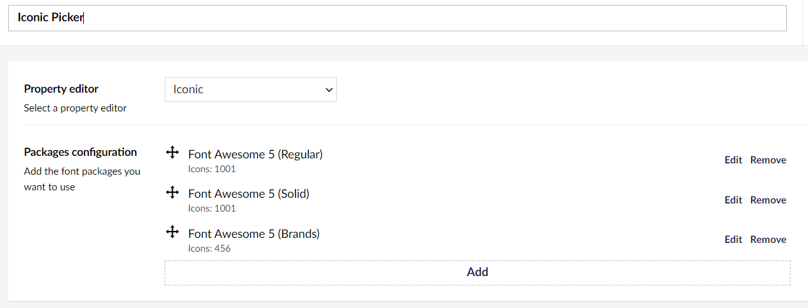

# Iconic Configuration: Font Awesome version 5

Font Awesome 5 doesn't include a CSS file which can be used as-is for the **Rules source file**, so to use version 5, you will need to add a few customized files to your site just for the Iconic DataType configuration (they don't need to be referenced on the front-end of your site at all).

[Font Awesome 5 Icons Reference](https://fontawesome.com/v5/search)


## Font Awesome v 5.15.4 (Last v5 Release)

1. Obtain the [Icon files](https://fontawesome.com/v5/docs/web/) from the font awesome website.
2. Download the [v5.15.4 rules files](FA.5.15.4/) and place into a directory in your website.
2. When [creating the DataType](../readme.md), add separate configurations for each style group you want available:



### Configuration Details


| **Font Awesome 5 (Regular)**  | Property Value |
| ------------- | ------------- |
| Template:  |  `<i class="far {icon}"></i>`  |
| Override Backoffice Template: | TRUE  |
| Enter a backoffice template:  |  `<span class="far {icon}" style="font-size: 30px;"></span>`  |
| CSS file:  | `/YOUR_FA_FILES_DIRECTORY/all.css`  |
| Selector: | `\.(fa-[\w-]+):before {` |
| Rules source file:  | `/YOUR_FA_RULES_FILES_DIRECTORY/fa-v5.15.4-Free-regular.css` or `/YOUR_FA_RULES_FILES_DIRECTORY/fa-v5.15.4-Pro-regular.css` |


| **Font Awesome 5 (Solid)**  | Property Value |
| ------------- | ------------- |
| Template:  |  `<i class="fas {icon}"></i>`  |
| Override Backoffice Template: | TRUE  |
| Enter a backoffice template:  |  `<span class="fas {icon}" style="font-size: 30px;"></span>`  |
| CSS file:  | `/YOUR_FA_FILES_DIRECTORY/all.css`  |
| Selector: | `\.(fa-[\w-]+):before {` |
| Rules source file:  | `/YOUR_FA_RULES_FILES_DIRECTORY/fa-v5.15.4-Free-solid.css` or `/YOUR_FA_RULES_FILES_DIRECTORY/fa-v5.15.4-Pro-solid.css` |

 
| **Font Awesome 5 (Brands)**  | Property Value |
| ------------- | ------------- |
| Template:  |  `<i class="fab {icon}"></i>`  |
| Override Backoffice Template: | TRUE  |
| Enter a backoffice template:  |  `<span class="fab {icon}" style="font-size: 30px;"></span>`  |
| CSS file:  | `/YOUR_FA_FILES_DIRECTORY/all.css`  |
| Selector: | `\.(fa-[\w-]+):before {` |
| Rules source file:  | `/YOUR_FA_RULES_FILES_DIRECTORY/fa-v5.15.4-Free-brands.css` or `/YOUR_FA_RULES_FILES_DIRECTORY/fa-v5.15.4-Pro-brands.css` |

If you have a Pro license, you can add those additional styles following the previous examples.

**NOTE:** If some of your icons are not appearing in the Umbraco back-office, make a small tweak to the "all.css" file used in your configurations:

```
.far {
  font-family: 'Font Awesome 5 Free';
  font-weight: 400; }
```

to 

```
.far {
  font-family: 'Font Awesome 5 Free';
  font-weight: 600; }
```

([Discussion about this odd hack...](https://github.com/skartknet/Iconic/discussions/13))
 


## Font Awesome v 5.3.0

In 2018 Christopher Robinson first cracked the Font Awesome 5 challenge and wrote a [great blog post](https://www.edg3.co.uk/blog/how-to-add-font-awesome-v5-icons-using-iconic-in-umbraco) about it, and provided a set of [v5.3.0 rules files](https://github.com/christopherrobinson/Font-Awesome-Icons/tree/master/css).


